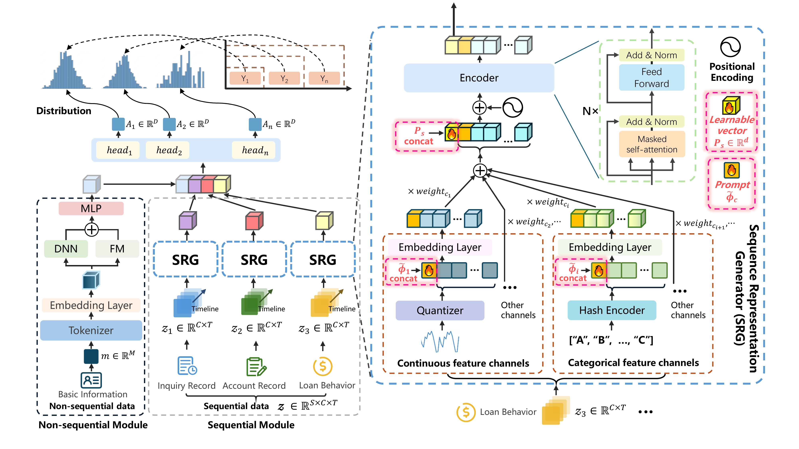

# FinLangNet

**A Unified Framework for Modeling Heterogeneous Financial Data via Dual-Granularity Prompting**

> Yu Lei†, Zixuan Wang†\*, Yiqing Feng†, Junru Zhang, Yahui Li, Chu Liu, Tongyao Wang, Dongyang Li
>
> † DiDi International Business Group &nbsp;|&nbsp; Beijing University of Posts and Telecommunications &nbsp;|&nbsp; Zhejiang University
>
> \* Corresponding author

[](./FinLangNet_full_paper.pdf)
[](./LICENSE)

---

## Overview

Industrial credit scoring models remain heavily reliant on manually tuned statistical methods. Deep learning architectures have struggled to consistently outperform them due to the complexity of **heterogeneous financial data** and the challenge of modeling **evolving creditworthiness** over time.

FinLangNet reformulates credit scoring as a **multi-scale sequential representation learning** problem. It processes heterogeneous financial data through a dual-module architecture that:

1. Extracts static feature interactions from tabular personal data via **DeepFM**.
2. Generates probability distributions of users' future financial behaviors across **multiple time horizons** via a **Sequence Representation Generator (SRG)** with a novel dual-prompt mechanism.

**Key Results:**
- **+6.3 pp** absolute gain in KS over the production XGBoost baseline
- **−9.9%** relative reduction in bad debt rate in a controlled A/B test
- State-of-the-art performance on 5 UEA multivariate time series benchmarks

---

## Architecture



FinLangNet consists of two complementary modules fused into a shared representation for multi-scale credit risk prediction.

### Non-Sequential Module (DeepFM)

Processes static personal attributes (demographics, income bracket, etc.) that are invariant over time.

- **FM Component**: captures pairwise feature interactions via inner products of latent vectors.
- **DNN Component**: models high-order non-linear correlations through a deep MLP.
- Output: static embedding **O_m ∈ R^256**.

### Sequential Module — SRG (Sequence Representation Generator)

Transforms multi-source temporal financial records into a unified behavioral representation. Three independent channels are encoded in parallel:

| Channel | Description | Seq. Len. | Features |
|---|---|---|---|
| Basic Information | Static personal profile | — | 11 |
| Credit Report: Inquiry | External credit bureau queries | 120 | 5 |
| Credit Report: Account | History of credit lines | 200 | 29 |
| Loan Behavior | Repayment & borrowing logs | 26 | 241 |

**Discretization**: Continuous features are first discretized into discrete tokens via frequency-based binning, mitigating noise and sparsity in raw financial sequences.

**Dual-Prompt Mechanism** (key innovation):
- **Feature-level Prompt (φ_c)**: A learnable token prepended to each channel's sequence. After Transformer encoding, its output aggregates channel-specific global patterns — analogous to the `[CLS]` token in BERT.
- **User-level Prompt (P_s)**: A global learnable vector that aggregates cross-channel representations via weighted attention, capturing holistic user behavior across all data sources.

### Multi-scale Credit Risk Prediction

The fused representation is projected through shared branch layers (512→256→128→32) into **7 prediction heads**, each targeting a specific (days-on-book, days-past-due) delinquency horizon:

| Head | DOB Window | DPD Threshold |
|---|---|---|
| dob45dpd7  | 45 days  | 7 days |
| dob90dpd7  | 90 days  | 7 days |
| dob90dpd30 | 90 days  | 30 days |
| dob120dpd7 | 120 days | 7 days |
| dob120dpd30| 120 days | 30 days |
| dob180dpd7 | 180 days | 7 days |
| dob180dpd30| 180 days | 30 days |

A **DependencyLayer** enforces monotonic ordering between heads sharing the same DPD threshold, ensuring `P(dpd30 | dob) ≥ P(dpd7 | dob)`.

---

## Repository Structure

```
FinLangNet/
├── Model/
│   ├── FinLangNet.py          # Core model definition
│   ├── model_train.py         # Training script
│   ├── model_infer.py         # Inference script
│   ├── train_loss.py          # Loss functions (DiceBCE, FocalTversky, DynamicWeightAverage)
│   ├── metric_record.py       # KS / AUC metric logging
│   ├── sentences_load.py      # Dataset loader with data augmentation
│   ├── xai.py                 # Feature importance (perturbation-based XAI)
│   ├── Modules/
│   │   ├── attention.py       # FullAttention, AttentionLayer
│   │   ├── encode.py          # Encoder, EncoderLayer
│   │   └── embedding.py       # PositionalEmbedding, TokenEmbedding, DataEmbedding
│   └── other_models/          # Baseline models (GRU, LSTM, Transformer, StackGRU variants)
├── Data_process/
│   ├── data_token.py          # Categorical feature tokenizers
│   ├── data_binning.py        # Frequency-based numeric discretization
│   └── data_augnment.py       # Sequence augmentation (delete / modify / subseries)
├── data_sample.json           # Sample data illustrating the input format
├── test_data_sample.ipynb     # Walkthrough: raw data → language structure
├── label_analysis.ipynb       # Online baseline comparison (XGBoost vs FinLangNet)
├── Deployment_applications.md # Real-world deployment details and A/B test results
└── FinLangNet_full_paper.pdf  # Full paper
```

---

## Data Format

The relationship between processed input data and the language structure is demonstrated in **[test_data_sample.ipynb](./test_data_sample.ipynb)**.

Sample data is provided in **[data_sample.json](./data_sample.json)**.

### Input Structure

Each sample is a tab-separated record with the following fields (see `sentences_load.py`):

```
feature1 \t feature2 \t len1 \t label1 \t label2 \t label3 \t feature3 \t feature4 \t feature5 \t feature6 \t feature7 \t feature8
```

- `feature1`: Monthly income bracket (tokenized)
- `feature2`: Inquiry type (tokenized)
- `feature3/4`: Loan behavior categorical and numeric sequences (comma-separated)
- `feature5/6`: Credit inquiry sequences
- `feature7/8`: Account record sequences
- `label1/2/3`: Binary delinquency labels across multiple horizons

### Data Preprocessing Pipeline

1. **Tokenization** (`Data_process/data_token.py`): Encodes categorical values (inquiry type, income bracket) to integer indices.
2. **Discretization** (`Data_process/data_binning.py`): Applies frequency-based quantile binning to continuous numeric sequences, converting them to discrete tokens. Bin edges are computed offline and stored as `.pkl` files.
3. **Augmentation** (`Data_process/data_augnment.py`): During training, minority-class (default) samples are augmented with probability 0.8 using three strategies:
   - **Delete**: randomly removes 10–30% of sequence entries and pads.
   - **Subseries**: randomly crops a 50–90% contiguous sub-window and pads.
   - **Modify**: randomly replaces entries with adjacent values (simulating minor noise).

---

## Installation

```bash
git clone https://github.com/didi/FinLangNet.git
cd FinLangNet
pip install torch numpy pandas scikit-learn
```

**Requirements**: Python ≥ 3.8, PyTorch ≥ 1.10

---

## Training

```bash
cd Model
python model_train.py
```

Key hyperparameters (see Table 6 in the paper):

| Parameter | Value |
|---|---|
| Optimizer | AdamW |
| Learning Rate | 5e-4 (cosine annealing) |
| Weight Decay | 0.01 |
| Batch Size | 512 |
| Epochs | 12 |
| Dropout Rate | 0.2 |
| Early Stopping Patience | 3 |
| Embedding Dimension | 512 |
| Transformer Layers | 10 |
| Attention Heads | 16 |

The best model checkpoint (by dob90dpd7 KS on the validation set) is saved to `./model.pth`.

---

## Inference

```bash
cd Model
python model_infer.py
```

The inference script loads `./results/FinLangNet.pth` and runs the model over the validation set, collecting predictions for all 7 heads alongside user IDs and timestamps for downstream analysis.

---

## Explainability (XAI)

`Model/xai.py` implements a **perturbation-based feature importance** method. For each feature channel, sub-features are independently perturbed by a small integer δ and the average change in model output is used as the importance score. This is the technique used to generate the feature importance rankings reported in the paper.

```python
from Model.xai import evaluate_feature_importance
importances = evaluate_feature_importance(model, input_features, all_inputs,
                                          non_evaluated_features_indices)
```

---

## Baseline Models

Baseline sequential models are provided in `Model/other_models/`:

| File | Model |
|---|---|
| `gru_deepfm.py` | GRU + DeepFM |
| `gru_attention_deepfm.py` | GRU with Attention + DeepFM |
| `lstm_deepfm.py` | LSTM + DeepFM |
| `stack_gru_deepfm.py` | Stacked GRU + DeepFM |
| `transformer_deepfm.py` | Transformer + DeepFM (standard, without dual-prompt) |

All baselines share the same multi-scale prediction head and training loop as FinLangNet.

---

## Experimental Results

### Industrial Credit Risk Assessment (Table 1 in the paper)

Evaluated on a proprietary dataset of 7M+ real-world users with 6 delinquency prediction tasks (τ ∈ {1, 2, ..., 6}).

| Model | Avg KS (%) |
|---|---|
| XGBoost (production baseline) | ~28 |
| GRU + DeepFM | 29.97 |
| Transformer + DeepFM | 30.97 |
| **FinLangNet** | **34.08** |
| **FinLangNet + XGBoost (deployed)** | **34.08** |

FinLangNet achieves a **+6.3 pp** KS improvement over the standalone XGBoost baseline across deployment.

### UEA Time Series Classification (Table 9)

Evaluated on 5 representative multivariate time series datasets using only the SRG module.  The SRG module achieves competitive or state-of-the-art performance against specialized MTSC methods (EDI, DTWI, MLSTM-FCNs, TapNet, ShapeNet, TStamp, SVP-T) on AtrialFibrillation, BasicMotions, EthanolConcentration, Heartbeat, and SelfRegulationSCP2.

### Ablation Study (Table 3)

| Configuration | KS (%) | AUC (%) |
|---|---|---|
| Baseline (No Prompts) | 32.62 | 72.54 |
| + Feature-level Prompt (φ_c) | 32.79 | 72.65 |
| + User-level Prompt (P_s) | 32.99 | 72.66 |
| **+ Both Prompts (Full Model)** | **34.08** | **73.55** |
| w/o Sequential Module (O_bs) | 12.53 | 58.62 |
| w/o Non-sequential Module (O_m) | 32.75 | 72.66 |

Removing the sequential module causes a catastrophic KS drop of >20%, confirming that temporal behavioral dynamics are the dominant predictor.

---

## Deployment

FinLangNet has been deployed in production at DiDi International Business Group's cash loan service for mid-loan behavior scoring (B-Score), serving millions of users.

The deployed system uses FinLangNet as a **deep learning sub-score feature** fed into an interpretability-centric XGBoost model — a fusion approach that satisfies regulatory explainability requirements while capturing complex temporal patterns.

See **[Deployment_applications.md](./Deployment_applications.md)** for full details on the deployment architecture, online A/B test results, and real-world risk analysis.

---

## Core Module

The sequence modeling core is also available as a standalone repository:

**TimeLangNet**: https://github.com/leiyu0210/TimeLangNet

---

## Citation

If you use this code or the FinLangNet framework in your research, please cite:

```bibtex
@article{lei2025finlangnet,
  title     = {A Unified Framework for Modeling Heterogeneous Financial Data
               via Dual-Granularity Prompting},
  author    = {Lei, Yu and Wang, Zixuan and Feng, Yiqing and Zhang, Junru and
               Li, Yahui and Liu, Chu and Wang, Tongyao and Li, Dongyang},
  year      = {2025},
}
```

---

## License

This project is released under the [MIT License](./LICENSE).
